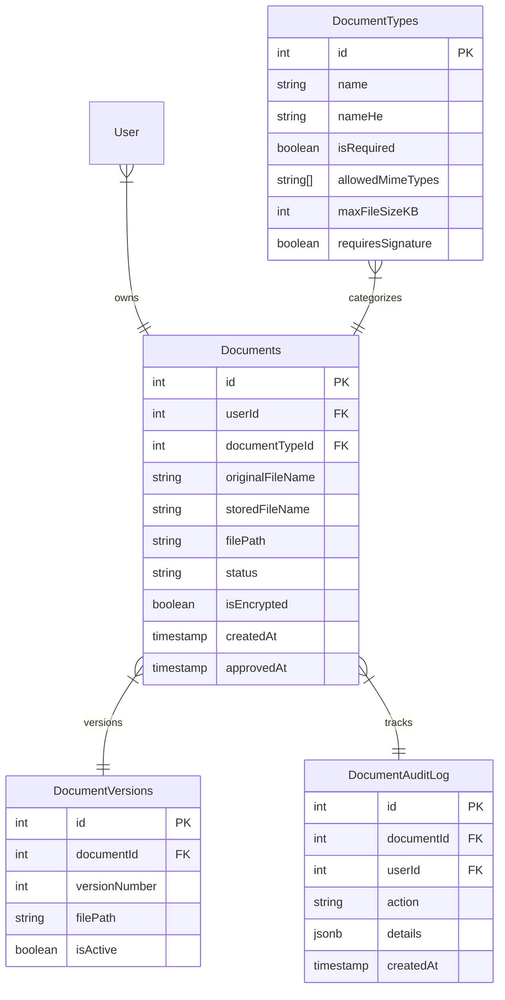
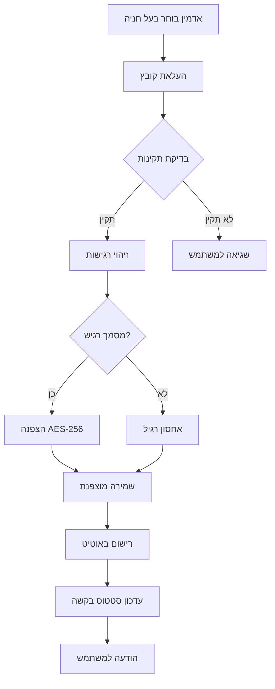
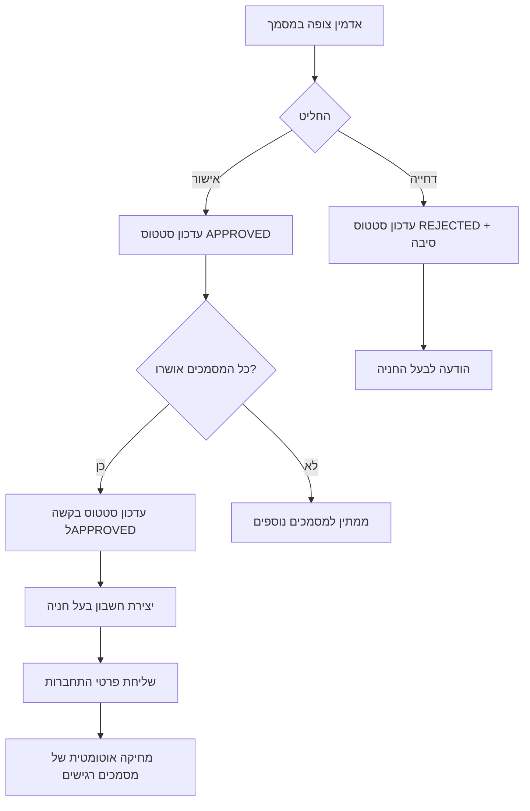
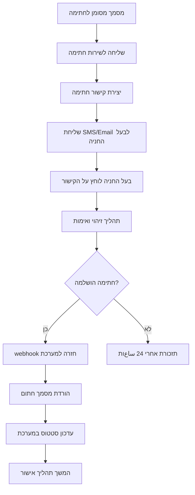

# 🏗️ **ארכיטקטורת מערכת מסמכים - תיעוד מלא**

## 🎯 **סקירה כללית**

מערכת ניהול מסמכים מתקדמת לאישור בעלי חניה, הכוללת:
- 📄 ניהול מסמכים דיגיטליים מאובטח
- ✍️ חתימה דיגיטלית מאומתת
- 🔐 הצפנה רב-שכבתית
- 📊 מעקב ואישור אוטומטי
- 🛡️ עמידה בתקנות הגנת פרטיות

---

## 🗂️ **רכיבי המערכת**

### **1. שכבת מסד הנתונים (Database Layer)**


### **2. שכבת אחסון קבצים (File Storage Layer)**
```
📁 File Storage Architecture
├── 🔐 Encrypted Storage (Critical Documents)
│   ├── Identity Documents (AES-256-GCM)
│   ├── Ownership Certificates (AES-256-CBC)
│   └── Personal Information (Multi-layer encryption)
├── 🌐 Public Storage (Approved Documents) 
│   ├── Parking Photos
│   ├── Signed Agreements
│   └── Public Certificates
├── ⏳ Temporary Storage (Processing)
│   ├── Upload Queue
│   ├── Virus Scanning
│   └── Format Conversion
└── 💾 Backup & Archive
    ├── Daily Backups
    ├── Weekly Archives
    └── Legal Retention
```

### **3. שכבת API (Application Layer)**
```javascript
// API Endpoints Structure
const DOCUMENTS_API = {
  
  // העלאת מסמכים
  upload: {
    endpoint: 'POST /api/admin/documents/upload',
    auth: 'admin',
    validation: ['file-type', 'size', 'virus-scan'],
    encryption: 'auto-detect-sensitivity'
  },
  
  // ניהול מסמכים
  management: {
    list: 'GET /api/admin/documents/:userId',
    view: 'GET /api/documents/secure/:id',
    approve: 'POST /api/admin/documents/:id/approve',
    reject: 'POST /api/admin/documents/:id/reject',
    delete: 'DELETE /api/admin/documents/:id'
  },
  
  // חתימה דיגיטלית
  signature: {
    request: 'POST /api/documents/:id/sign-request',
    status: 'GET /api/documents/:id/sign-status',
    webhook: 'POST /api/webhooks/signature-complete'
  },
  
  // הגנת פרטיות
  privacy: {
    export: 'GET /api/privacy/data-export/:userId',
    delete: 'POST /api/privacy/delete-user-data/:userId',
    restrict: 'POST /api/documents/:id/restrict-processing'
  }
};
```

---

## 🔄 **זרימות עבודה (Workflows)**

### **זרימת העלאת מסמך:**


### **זרימת אישור מסמכים:**


### **זרימת חתימה דיגיטלית:**


---

## 🔐 **מודל אבטחה**

### **שכבות הגנה:**
```
🛡️ Multi-Layer Security Model

1️⃣ Network Layer (Perimeter)
├── Firewall Rules
├── DDoS Protection  
├── Rate Limiting
└── IP Whitelisting (Admin)

2️⃣ Application Layer (Access)
├── JWT Authentication
├── Role-Based Access Control
├── API Validation
└── Input Sanitization

3️⃣ Data Layer (Protection)  
├── Field-Level Encryption
├── Database Encryption at Rest
├── Secure Key Management
└── Data Masking

4️⃣ File Layer (Storage)
├── AES-256 File Encryption
├── Secure File Upload
├── Virus Scanning
└── Content Validation

5️⃣ Audit Layer (Monitoring)
├── Comprehensive Logging
├── Real-time Monitoring
├── Anomaly Detection
└── Compliance Reporting
```

### **מטריקס הרשאות:**
| תפקיד | צפייה | העלאה | אישור | מחיקה | ניהול |
|--------|--------|-------|--------|-------|--------|
| **בעל חניה** | 🟢 שלו | ❌ | ❌ | ❌ | ❌ |
| **אדמין** | 🟢 הכל | 🟢 | 🟢 | 🟡 מוגבל | 🟢 |
| **סופר אדמין** | 🟢 הכל | 🟢 | 🟢 | 🟢 | 🟢 |
| **מערכת** | 🟢 עיבוד | 🟢 אוטו | 🟡 חלקי | 🟢 אוטו | ❌ |

---

## 📊 **ביצועים וקנה מידה**

### **יעדי ביצועים:**
```javascript
const PERFORMANCE_TARGETS = {
  upload: {
    maxFileSize: '10MB',
    uploadTime: '< 30 seconds',
    throughput: '100 concurrent uploads'
  },
  
  processing: {
    encryptionTime: '< 5 seconds per MB',
    virusScan: '< 10 seconds per file',
    thumbnailGeneration: '< 3 seconds'
  },
  
  access: {
    documentRetrieval: '< 2 seconds',
    searchResponse: '< 1 second',
    auditQuery: '< 5 seconds'
  },
  
  availability: {
    uptime: '99.9%',
    backupFrequency: 'Every 24 hours',
    recoveryTime: '< 4 hours'
  }
};
```

### **אסטרטגיית קנה מידה:**
```
📈 Scalability Strategy

Horizontal Scaling:
├── 📁 File Storage: Distributed file system
├── 💾 Database: Read replicas + Sharding
├── 🖥️ App Servers: Load-balanced instances
└── 🌐 CDN: Global content distribution

Vertical Scaling:
├── 💪 CPU: Multi-core processing
├── 🧠 Memory: In-memory caching
├── 💽 Storage: SSD + NVMe drives
└── 🌐 Network: High-bandwidth connections

Caching Layers:
├── 📋 Application Cache (Redis)
├── 🗄️ Database Query Cache
├── 📁 File Metadata Cache
└── 🌍 CDN Edge Caching
```

---

## 🚀 **תכנית פריסה (Deployment)**

### **שלבי הטמעה:**
```
Phase 1: Foundation (Week 1-2)
├── ✅ Database Schema Migration
├── ✅ Basic File Upload API  
├── ✅ Encryption Services
└── ✅ Admin Interface (Basic)

Phase 2: Core Features (Week 3-4)
├── 📋 Document Management UI
├── 🔍 Document Viewer
├── ✅ Approval Workflow
└── 📊 Basic Reporting

Phase 3: Advanced Features (Week 5-6)
├── ✍️ Digital Signature Integration
├── 🔐 Advanced Security Features
├── 📈 Performance Optimization
└── 📱 Mobile Responsive Design

Phase 4: Production Ready (Week 7-8)
├── 🧪 Security Testing
├── 📊 Performance Testing  
├── 🛡️ Compliance Audit
└── 📚 Documentation & Training
```

### **סביבות פיתוח:**
```
🔄 Environment Pipeline

Development Environment:
├── 💻 Local Development
├── 🧪 Unit Testing
├── 📁 Sample Data
└── 🔧 Debug Mode

Staging Environment:  
├── 🎯 Integration Testing
├── 👥 User Acceptance Testing
├── 📊 Performance Testing
└── 🔒 Security Scanning

Production Environment:
├── 🌐 Live System
├── 📈 Monitoring & Alerting
├── 💾 Automated Backups
└── 🛡️ Security Hardening
```

---

## 📋 **רשימת תלות חיצונית**

### **שירותים חיצוניים:**
| שירות | מטרה | ספק מומלץ | חיוניות |
|--------|------|-----------|---------|
| **חתימה דיגיטלית** | אימות מסמכים | DocuSign / Adobe Sign | 🔴 קריטי |
| **אחסון ענן** | גיבוי חיצוני | AWS S3 / Azure Blob | 🟡 חשוב |
| **סריקת וירוסים** | אבטחת קבצים | ClamAV / VirusTotal | 🔴 קריטי |
| **CDN** | הגשת קבצים | CloudFlare / AWS CloudFront | 🟢 שיפור |
| **SMS Gateway** | התראות | Twilio / AWS SNS | 🟡 חשוב |
| **Email Service** | הודעות | SendGrid / AWS SES | 🟡 חשוב |

### **ספריות ותלויות:**
```javascript
// Package Dependencies
const DEPENDENCIES = {
  backend: {
    encryption: ['crypto', 'node-forge'],
    fileUpload: ['multer', 'express-fileupload'],  
    imageProcessing: ['sharp', 'pdf2pic'],
    validation: ['joi', 'express-validator'],
    monitoring: ['winston', 'prometheus']
  },
  
  frontend: {
    upload: ['react-dropzone', 'axios'],
    preview: ['react-pdf', 'react-image-gallery'],
    ui: ['react', 'material-ui', 'styled-components'],
    state: ['redux', 'react-query']
  }
};
```

---

## 🔍 **ניטור ואנליטיקה**

### **מדדי KPI:**
```javascript
const KPI_METRICS = {
  business: {
    documentsProcessed: 'Total documents uploaded',
    approvalTime: 'Average time from upload to approval',
    automationRate: 'Percentage of auto-approved requests',
    userSatisfaction: 'Approval process satisfaction score'
  },
  
  technical: {
    systemUptime: '99.9% availability target',
    responseTime: 'API response times < 2sec',
    errorRate: 'Error rate < 0.1%',
    securityIncidents: 'Zero critical security breaches'
  },
  
  compliance: {
    dataRetention: 'Proper document lifecycle management',
    accessControl: 'Unauthorized access attempts',
    auditCompleteness: '100% audit trail coverage',
    privacyRequests: 'GDPR/Privacy request response time'
  }
};
```

### **דשבורד ניטור:**
```
📊 Monitoring Dashboard

Real-time Metrics:
├── 📈 Upload Rate (files/hour)
├── ⚡ Processing Speed (avg time)
├── 🔒 Security Events (alerts)
└── 💾 Storage Usage (GB used)

Daily Reports:
├── 📋 Documents Processed
├── ✅ Approval Rates
├── 🚨 Error Summary  
└── 👥 User Activity

Weekly Analytics:
├── 📊 Trend Analysis
├── 🎯 Performance KPIs
├── 🛡️ Security Assessment
└── 💰 Cost Analysis
```

---

## 🎓 **הדרכה ותיעוד**

### **מדריכי משתמש:**
- 📖 **מדריך אדמין**: ניהול מסמכים וממשק אישור
- 📱 **מדריך בעל חניה**: העלאת מסמכים וחתימה דיגיטלית
- 🔧 **מדריך טכני**: התקנה, תצורה ותחזוקה
- 🛡️ **מדריך אבטחה**: נהלי אבטחה והגנת פרטיות

### **הדרכת צוות:**
```
👥 Training Program

Week 1: System Overview
├── 🎯 Business Requirements
├── 🏗️ Architecture Overview  
├── 🔐 Security Principles
└── 📋 Compliance Requirements

Week 2: Technical Training
├── 💻 Admin Interface Usage
├── 📁 Document Management
├── 🔍 Troubleshooting Guide
└── 📊 Monitoring & Reporting

Week 3: Hands-on Practice
├── 🧪 Test Environment
├── 📝 Common Scenarios
├── 🚨 Incident Response
└── ✅ Certification Test
```

---

**✅ מערכת המסמכים מתוכננת להיות מקצועית, מאובטחת ועומדת בכל התקנות הנדרשות!**

## 📋 **סיכום שלב 2.1**

המערכת כוללת:
- 🗄️ **מבנה מסד נתונים** מתקדם ומקצועי
- 📁 **מערכת אחסון** מאובטחת ומוצפנת  
- 🛡️ **מדיניות אבטחה** עומדת בתקנות ישראליות ובינלאומיות
- ✅ **רשימת בדיקה** מלאה לעמידה בתקנות
- 📖 **תיעוד מקיף** של כל הארכיטקטורה

**השלב הבא: Step 2.2 - יישום מערכת העלאת מסמכים!** 🚀
