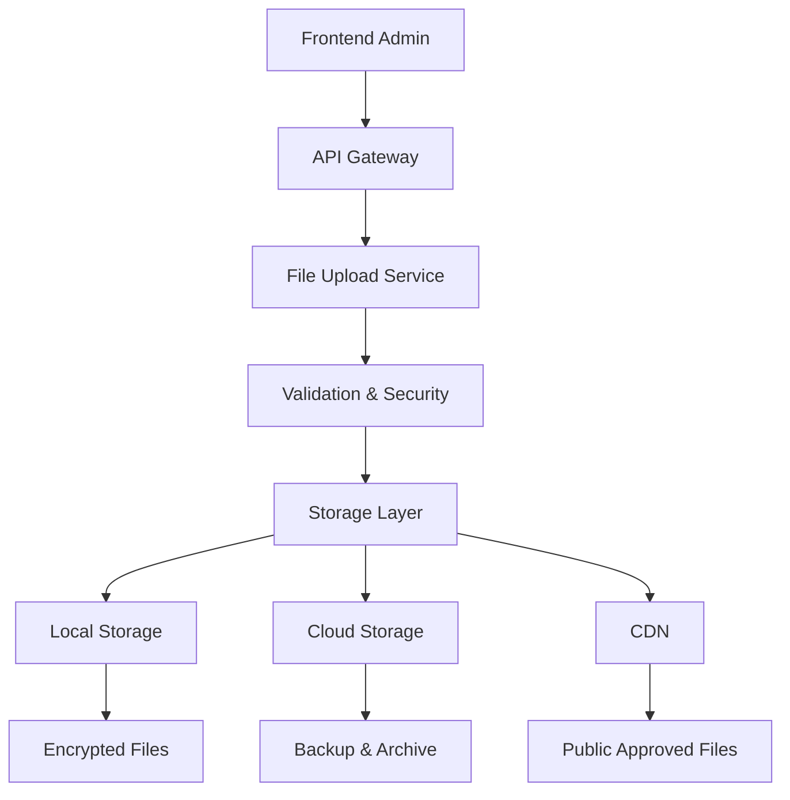

# 📁 **ארכיטקטורת אחסון קבצים מאובטחת**

## 🎯 **מטרות מערכת האחסון**

### **דרישות טכניות:**
- 🔐 **אבטחה**: הצפנת קבצים רגישים end-to-end
- ⚡ **ביצועים**: גישה מהירה וCDN לקבצים מאושרים
- 💾 **גיבוי**: גיבוי אוטומטי וrecovery
- 🌍 **זמינות**: 99.9% uptime
- 📏 **קנה מידה**: תמיכה במיליוני קבצים
- 🗂️ **ארגון**: מבנה תיקיות הירארכי וברור

### **סוגי קבצים נתמכים:**
- 📄 **PDF**: מסמכים רשמיים, חוזים
- 🖼️ **תמונות**: JPG, PNG, WEBP (תעודות, תמונות חניה)
- 📝 **חתימות**: קבצי חתימה דיגיטלית

---

## 🏗️ **ארכיטקטורה כללית**

### **שכבות האחסון:**



---

## 📂 **מבנה תיקיות מוצע**

### **תיקיות בשרת מקומי:**
```
/zpoto-files/
├── documents/
│   ├── encrypted/           # קבצים מוצפנים (ת"ז, מסמכים רגישים)
│   │   ├── 2024/
│   │   │   ├── 10/          # לפי חודש
│   │   │   │   ├── user-123/
│   │   │   │   │   ├── identity/
│   │   │   │   │   │   └── abc123.enc
│   │   │   │   │   ├── ownership/
│   │   │   │   │   └── contracts/
│   ├── public/              # קבצים לא רגישים (תמונות חניה מאושרות)
│   │   ├── 2024/10/
│   │   │   └── parking-photos/
│   │   │       └── def456.jpg
│   ├── temp/                # קבצים זמניים (לפני עיבוד)
│   │   └── upload-789/
│   ├── signed/              # מסמכים חתומים דיגיטלית
│   │   ├── 2024/10/
│   │   │   └── contracts/
│   └── backups/             # גיבויים מקומיים
│       ├── daily/
│       ├── weekly/
│       └── monthly/
```

### **נתיבי אחסון מוצפנים:**
```javascript
// דוגמה לפונקציית יצירת נתיב
function generateSecureFilePath(userId, documentType, isEncrypted = false) {
  const year = new Date().getFullYear();
  const month = String(new Date().getMonth() + 1).padStart(2, '0');
  const uniqueId = crypto.randomUUID();
  
  const basePath = `/zpoto-files/documents`;
  const securityPath = isEncrypted ? 'encrypted' : 'public';
  
  return {
    directory: `${basePath}/${securityPath}/${year}/${month}/user-${userId}/${documentType}`,
    filename: `${uniqueId}${isEncrypted ? '.enc' : ''}`,
    fullPath: `${basePath}/${securityPath}/${year}/${month}/user-${userId}/${documentType}/${uniqueId}${isEncrypted ? '.enc' : ''}`
  };
}
```

---

## 🔐 **מערכת הצפנה**

### **הצפנת קבצים רגישים:**
```javascript
// שירות הצפנה
class FileEncryptionService {
  
  // הצפנת קובץ עם AES-256
  static async encryptFile(filePath, userId, documentType) {
    const algorithm = 'aes-256-gcm';
    
    // יצירת מפתח ייחודי לכל קובץ
    const fileKey = crypto.randomBytes(32);
    const iv = crypto.randomBytes(16);
    
    // קריאת הקובץ המקורי
    const fileBuffer = await fs.readFile(filePath);
    
    // הצפנה
    const cipher = crypto.createCipher(algorithm, fileKey);
    cipher.setAAD(Buffer.from(`${userId}:${documentType}`));
    
    const encrypted = Buffer.concat([
      cipher.update(fileBuffer),
      cipher.final()
    ]);
    
    const authTag = cipher.getAuthTag();
    
    // שמירת הקובץ המוצפן
    const encryptedData = {
      iv: iv.toString('hex'),
      authTag: authTag.toString('hex'),
      data: encrypted.toString('hex')
    };
    
    return {
      encryptedFile: JSON.stringify(encryptedData),
      fileKey: fileKey.toString('hex'), // ישמר מוצפן במסד הנתונים
      originalSize: fileBuffer.length,
      encryptedSize: encrypted.length
    };
  }
  
  // פענוח קובץ
  static async decryptFile(encryptedFilePath, fileKey, userId, documentType) {
    const algorithm = 'aes-256-gcm';
    
    // קריאת הקובץ המוצפן
    const encryptedData = JSON.parse(await fs.readFile(encryptedFilePath, 'utf8'));
    
    // פענוח
    const decipher = crypto.createDecipher(algorithm, Buffer.from(fileKey, 'hex'));
    decipher.setAAD(Buffer.from(`${userId}:${documentType}`));
    decipher.setAuthTag(Buffer.from(encryptedData.authTag, 'hex'));
    
    const decrypted = Buffer.concat([
      decipher.update(Buffer.from(encryptedData.data, 'hex')),
      decipher.final()
    ]);
    
    return decrypted;
  }
}
```

---

## 🛡️ **שכבות אבטחה**

### **1. אבטחה ברמת הקובץ:**
```javascript
// בדיקות אבטחה לפני העלאה
class FileSecurityValidator {
  
  static validateFileUpload(file, documentType) {
    const validations = [];
    
    // בדיקת סוג קובץ
    const allowedTypes = {
      'identity': ['application/pdf', 'image/jpeg', 'image/png'],
      'ownership': ['application/pdf'],
      'parking_photo': ['image/jpeg', 'image/png', 'image/webp']
    };
    
    if (!allowedTypes[documentType]?.includes(file.mimetype)) {
      validations.push('Invalid file type for document category');
    }
    
    // בדיקת גודל קובץ
    const maxSizes = {
      'identity': 5 * 1024 * 1024,      // 5MB
      'ownership': 10 * 1024 * 1024,    // 10MB  
      'parking_photo': 3 * 1024 * 1024  // 3MB
    };
    
    if (file.size > maxSizes[documentType]) {
      validations.push('File size exceeds limit');
    }
    
    // סריקת וירוסים (אינטגרציה עם ClamAV)
    const virusScanResult = this.scanForViruses(file.buffer);
    if (!virusScanResult.clean) {
      validations.push('File failed security scan');
    }
    
    // בדיקת תוכן הקובץ (למניעת malicious files)
    const contentValidation = this.validateFileContent(file.buffer, file.mimetype);
    if (!contentValidation.valid) {
      validations.push('File content validation failed');
    }
    
    return {
      valid: validations.length === 0,
      errors: validations
    };
  }
  
  static scanForViruses(fileBuffer) {
    // TODO: אינטגרציה עם ClamAV או שירות סריקה דומה
    return { clean: true };
  }
  
  static validateFileContent(buffer, mimetype) {
    // בדיקות בסיסיות על תוכן הקובץ
    if (mimetype === 'application/pdf') {
      return this.validatePDFContent(buffer);
    } else if (mimetype.startsWith('image/')) {
      return this.validateImageContent(buffer);
    }
    
    return { valid: false };
  }
}
```

### **2. בקרת גישה (Access Control):**
```javascript
// מערכת הרשאות גישה לקבצים
class FileAccessControl {
  
  // בדיקה האם המשתמש רשאי לגשת לקובץ
  static async canAccessFile(userId, documentId, action = 'view') {
    const document = await prisma.documents.findUnique({
      where: { id: documentId },
      include: { user: true }
    });
    
    if (!document) return false;
    
    const userRole = await this.getUserRole(userId);
    
    // בעלי החניה יכולים לגשת רק למסמכים שלהם
    if (userRole === 'OWNER') {
      return document.userId === userId && action === 'view';
    }
    
    // אדמינים יכולים לגשת לכל המסמכים
    if (userRole === 'ADMIN') {
      return true;
    }
    
    return false;
  }
  
  // יצירת URL זמני מאובטח לגישה לקובץ
  static generateSecureFileUrl(documentId, userId, expirationMinutes = 30) {
    const payload = {
      documentId,
      userId,
      exp: Math.floor(Date.now() / 1000) + (expirationMinutes * 60)
    };
    
    const token = jwt.sign(payload, process.env.FILE_ACCESS_SECRET);
    
    return {
      url: `/api/files/secure/${documentId}?token=${token}`,
      expiresAt: new Date(payload.exp * 1000)
    };
  }
}
```

---

## 💾 **אסטרטגיית גיבוי**

### **גיבוי היררכי:**
```javascript
// מערכת גיבוי אוטומטית
class BackupManager {
  
  // גיבוי יומי
  static async performDailyBackup() {
    const today = new Date().toISOString().split('T')[0];
    const backupPath = `/zpoto-files/backups/daily/${today}`;
    
    // גיבוי קבצים חדשים מהיום האחרון
    const recentFiles = await this.getRecentFiles(24); // 24 שעות אחרונות
    
    for (const file of recentFiles) {
      await this.copyToBackup(file.path, backupPath);
    }
    
    // דחיסת הגיבוי
    await this.compressBackup(backupPath);
    
    console.log(`✅ Daily backup completed: ${backupPath}`);
  }
  
  // גיבוי שבועי (לקבצים קריטיים)
  static async performWeeklyBackup() {
    const weekNumber = this.getWeekNumber(new Date());
    const backupPath = `/zpoto-files/backups/weekly/week-${weekNumber}`;
    
    // גיבוי כל הקבצים המוצפנים
    const encryptedFiles = await this.getEncryptedFiles();
    
    for (const file of encryptedFiles) {
      await this.copyToBackup(file.path, backupPath);
    }
    
    // העלאה לאחסון ענן
    await this.uploadToCloudStorage(backupPath);
    
    console.log(`✅ Weekly backup completed and uploaded to cloud`);
  }
  
  // ניקוי גיבויים ישנים
  static async cleanOldBackups() {
    // השאר רק 30 גיבויים יומיים
    await this.cleanBackupsByAge('/zpoto-files/backups/daily', 30);
    
    // השאר רק 12 גיבויים שבועיים
    await this.cleanBackupsByAge('/zpoto-files/backups/weekly', 12);
  }
}
```

---

## 🌐 **אינטגרציה עם CDN**

### **הגשת קבצים מאושרים:**
```javascript
// שירות CDN לקבצים ציבוריים
class CDNService {
  
  // העלאת קובץ מאושר ל-CDN
  static async publishToCSN(documentId) {
    const document = await prisma.documents.findUnique({
      where: { id: documentId }
    });
    
    if (document.status !== 'APPROVED') {
      throw new Error('Only approved documents can be published to CDN');
    }
    
    // העתקה לתיקיית CDN
    const cdnPath = `/zpoto-files/cdn/public/${document.userId}/${document.documentTypeId}`;
    const publicUrl = `${process.env.CDN_BASE_URL}/${document.userId}/${document.documentTypeId}/${document.storedFileName}`;
    
    await this.copyToPublicCDN(document.filePath, cdnPath);
    
    // עדכון כתובת הגישה הציבורית
    await prisma.documents.update({
      where: { id: documentId },
      data: { 
        publicUrl: publicUrl,
        isPubliclyAccessible: true
      }
    });
    
    return publicUrl;
  }
  
  // הסרה מ-CDN (למסמכים שנדחו)
  static async removeFromCDN(documentId) {
    const document = await prisma.documents.findUnique({
      where: { id: documentId }
    });
    
    if (document.publicUrl) {
      await this.deleteFromCDN(document.publicUrl);
      
      await prisma.documents.update({
        where: { id: documentId },
        data: { 
          publicUrl: null,
          isPubliclyAccessible: false
        }
      });
    }
  }
}
```

---

## 📊 **ניטור וביצועים**

### **מדדי ביצועים:**
```javascript
// מערכת מוניטורינג לקבצים
class FileStorageMonitoring {
  
  static async getStorageMetrics() {
    return {
      // נפח אחסון
      totalStorageUsed: await this.calculateTotalStorage(),
      storageByType: await this.getStorageByDocumentType(),
      
      // ביצועים
      averageUploadTime: await this.getAverageUploadTime(),
      averageDownloadTime: await this.getAverageDownloadTime(),
      
      // אבטחה
      encryptedFilesCount: await this.getEncryptedFilesCount(),
      securityIncidents: await this.getSecurityIncidents(),
      
      // גיבויים
      lastBackupTime: await this.getLastBackupTime(),
      backupSuccessRate: await this.getBackupSuccessRate()
    };
  }
  
  // התראות על בעיות
  static async checkHealthAndAlert() {
    const metrics = await this.getStorageMetrics();
    
    // בדיקת נפח דיסק
    if (metrics.totalStorageUsed > 0.8 * process.env.MAX_STORAGE_GB) {
      await this.sendAlert('Storage space running low', 'CRITICAL');
    }
    
    // בדיקת גיבויים
    const lastBackup = new Date(metrics.lastBackupTime);
    const hoursSinceBackup = (new Date() - lastBackup) / (1000 * 60 * 60);
    
    if (hoursSinceBackup > 25) { // אמור להיות גיבוי כל 24 שעות
      await this.sendAlert('Backup overdue', 'HIGH');
    }
  }
}
```

---

## 🔧 **תצורה והגדרות**

### **משתני סביבה נדרשים:**
```bash
# אחסון
ZPOTO_FILES_BASE_PATH=/zpoto-files
MAX_STORAGE_GB=1000
CLEANUP_TEMP_FILES_HOURS=24

# הצפנה
FILE_ENCRYPTION_KEY=your-256-bit-key-here
ENCRYPTION_ALGORITHM=aes-256-gcm

# CDN
CDN_BASE_URL=https://cdn.zpoto.co.il
CDN_ACCESS_KEY=your-cdn-access-key

# גיבוי
BACKUP_SCHEDULE_DAILY=0 2 * * *  # 02:00 כל לילה
BACKUP_SCHEDULE_WEEKLY=0 3 * * 0 # 03:00 כל יום ראשון
CLOUD_BACKUP_PROVIDER=aws-s3
CLOUD_BACKUP_BUCKET=zpoto-backups

# אבטחה
VIRUS_SCAN_ENABLED=true
MAX_FILE_SIZE_MB=10
ALLOWED_MIME_TYPES=application/pdf,image/jpeg,image/png
```

---

**✅ מערכת האחסון מתוכננת להיות מאובטחת, מהירה וניתנת לקנה מידה!**
